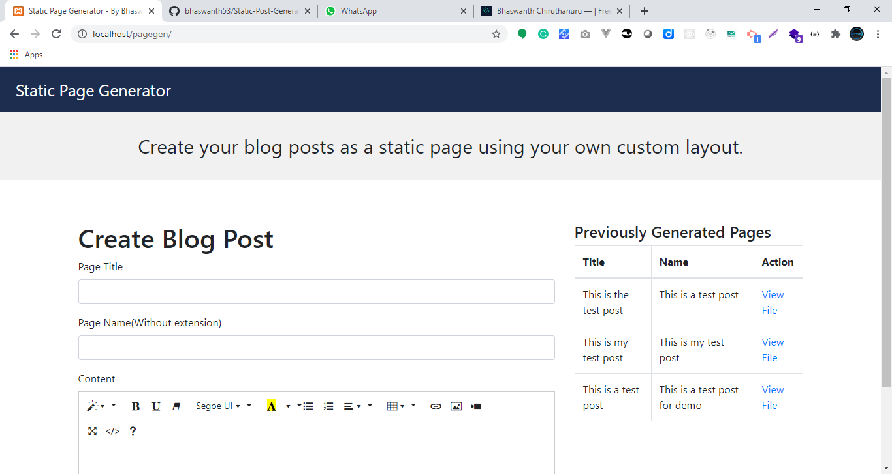

# Static Page Generator

For Demo Video: [https://youtu.be/n9-oMlcQx90](https://youtu.be/n9-oMlcQx90)



## Problem

Generally, the blog helps businesses a lot in order to increase SEO. But creating the blog will cost much amount since the blog contains databases and server-side languages like PHP, Node JS. We need to buy a proper hosting for that. But when it comes to people who are using free static hosting like Github Pages can't be able to write blogs on that same domain. So they need to create another third party blog using Blogspot, WordPress, or any others. We can connect these blogs using subdomains, but technically it will not comes under our own domain. So, it will be a problem for SEO. So, I created this project to help such kind of people to generate their blog posts as a static HTML page which will be hosted in any hosting.

## Solution

We can create blog posts as a static pages using this project. 

## Documentation

We can also modify the page template which is stored in **theme** folder as **template.php**. We just need to modify it and add the below line where we need to embed blog post.

```
**{{ content }}**
```

The pages will be created in **theme/pages** folder. And the page data will be saved in **data.json** file for the record.

All the pages contains fully minified HTML code, so they can be faster.

### Requirements
1. PHP >= 7.0

### Plugins used
1. [https://github.com/jenstornell/tiny-html-minifier](https://github.com/jenstornell/tiny-html-minifier)

Developed By: [Bhaswanth Chiruthanuru](http://bhaswanth.com/)